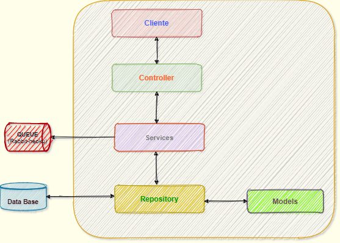

# sistemavotos
Solução para gerenciamento sessão votação.

== Introdução

Este projeto foi criado com a finaliade de implementar o que foi proposto no desafio técnico que tem como objetivo criar uma solução de back-end para gerenciar sessões de votação.

A solução desenvolvida consiste em:

- Camada de apresentação representada pelos controllers
- Camada de persistência utilizando hibernate/jpa representado pelos services e repositories.
- Camada de integração utilizando agentes de mensagem utilizando solução baseada no protocolo amqp

#Escolha da arquitetura

A escolha da arquiteura baseada em camadas se deu em função de se tratar de uma solução que deve expor serviços sendo assim a organização em camadas contribui para especializar os tipos de funções executadas por cada componente do software, criando um design altamente favorável a reutilização.
A escolha do framework spring foi a necessidade de otimização do tempo e em consequência o aumento da produtividade pois o mesmo oferece recursos para o processo de desenvolvimento de sofware.

Como solicitado foi implementado uma cominicação baseada em evento utilizando o RabbitMQ como barramento de evento.

== Funcionalidades e Validações

* Cadastrar pauta
* Iniciar Votação
**  Valida se votação já foi inicia
**  Valida se votação já foi encerrada
* Votar
** Valida se suário pode votar
** Valida se usuario já votou
** Valida se votação já foi encerrada
** Valida se a votação ainda não foi iniciada
* Apresentar resultado votação

== Testes

Foram realizados alguns testes de integração utilizando o spring-test e testes de perfomance.
Para o teste de performance foi utilizada a ferramenta jmeter para geração dos
scripts e a utilização de um plugin maven para poder executar os testes no momento do build.

Casos de testes:

* Votar
* Cadastrar pauta
* Listar pautas não iniciadas
* Iniciar pauta
* Exibir resultado votação

Executado através do mvn verify
O script está está na pasta src/test/resources/jmeter
Os relatórios da execução são gerados na pasta target/jmeter

== Documentação

A solução possui em maioria das suas classes documentação a nível de código e para documentação
da API foi utilizado o swagger sendo possível consultá-lo no endereço:

:hide-uri-scheme:
https://sisvotos.herokuapp.com/sistemavotos/swagger-ui/#/

== Agendamento e Messageria

Foi criado a uma solução de mensageria que consiste no envio de mensagem contendo o resultado 
da votação que foi finalizada em determinado momento.
A votação é iniciada informando a pauta e quantidade de tempo em minutos que votação deve 
durar, neste momento o sistema grava a data, hora, minuto e segundo em que a votação foi iniciada
e calcula o o tempo final da votação a partir do tempo de duração e persiste essas informações em banco.
Além disso um nesse momento do inicio da votação um serviço de execução agendada é iniciado tendo como
parâmetro a duração da votação. Esse serviço é basicamente para enviar o resultado para a fila de mensageria.

== Ambiente

Para uma demonstração mais efetiva do que foi feito criei doIs pipelines na plataforma HEROKU sendo no primeiro
está configurado a aplicação e o servidor de banco de dados postgree.
No segundo pipeline configurei o addons do RabbitMQ.
Todos utilizando free dynos, vai que vocês não me contratam.(linha da descontração).

Caso queiram observar a entrega das mensagens e o conteúdo:attribute

Host: https://fish.rmq.cloudamqp.com/
user: bqzncglo
passwd: N0fAGgphhvNDixtisk2NCBruzQbJ1nDC